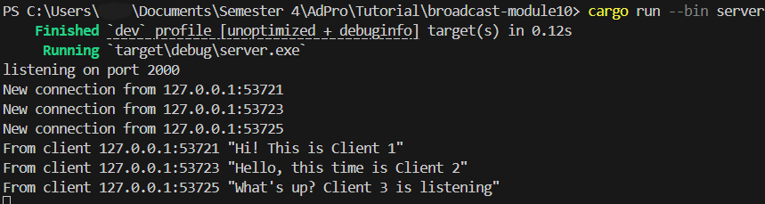

# Advanced Programming - Module 10 Broadcast
**Nama:**   &nbsp; Stefanus Tan Jaya 
**NPM:**    &nbsp;&ensp; 2306152456 
**Kelas:**  &nbsp; Pemrograman Lanjut A 

### 2.1 Original code and How It Runs
#### Client 1 View

#### Client 2 View

#### Client 3 View

#### Server View

Bisa dilihat bahwa Server berperan sebagai _listener_ dan menerima _connection_ dari tiap Client. Server akan menerima tiap pesan dari berbagai Client, kemudian memberitakan (_broadcast_) pesan yang baru diberikan kepada semua Client. Tiap Client dapat membuat pesannya sendiri dan menerima pesan dari Client lain yang terkoneksi dengan Server.