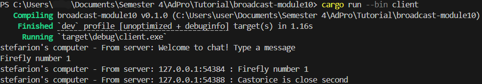
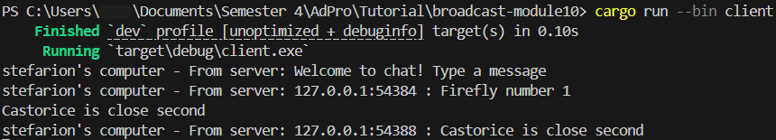
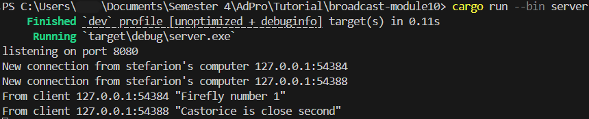

# Advanced Programming - Module 10 Broadcast
**Nama:**   &nbsp; Stefanus Tan Jaya 
**NPM:**    &nbsp;&ensp; 2306152456 
**Kelas:**  &nbsp; Pemrograman Lanjut A 

### 2.1 Original code and How It Runs
#### Client 1 View

#### Client 2 View

#### Client 3 View

#### Server View

  
Bisa dilihat bahwa Server berperan sebagai _listener_ dan menerima _connection_ dari tiap Client. Server akan menerima tiap pesan dari berbagai Client, kemudian memberitakan (_broadcast_) pesan yang baru diberikan kepada semua Client. Tiap Client dapat membuat pesannya sendiri dan menerima pesan dari Client lain yang terkoneksi dengan Server.

### 2.2 Modifying the Websocket Port
#### Client 1 View at 8080

#### Client 2 View at 8080

#### Client 3 View at 8080

#### Server Port 8080

  
Jika port Server dan Client diganti dengan port yang sama, maka aplikasi tetap berjalan normal. Namun, bila salah satu port diganti menjadi yang berbeda dengan satu sama lain, akan muncul error karena Client tidak menemukan target Server dengan port yang sesuai. Tampak errornya sebagai berikut.

### 2.3 Small Changes by Adding Some Information to Client
#### Modified Client 1

#### Modified Client 2

#### Modified Server

  
Informasi yang saya tambahkan salah satunya pada koneksi antara Server dan Client memiliki keterangan bahwa koneksi terjadi pada `stefarion's computer`. Selain itu, terdapat modifikasi `bcast_tx.send(format!("{addr} : {text}"))?` yang menghasilkan pesan _broadcast_ dengan format `address` dan `text`. Alhasil, semua Client dapat melihat _address_ Client lain.